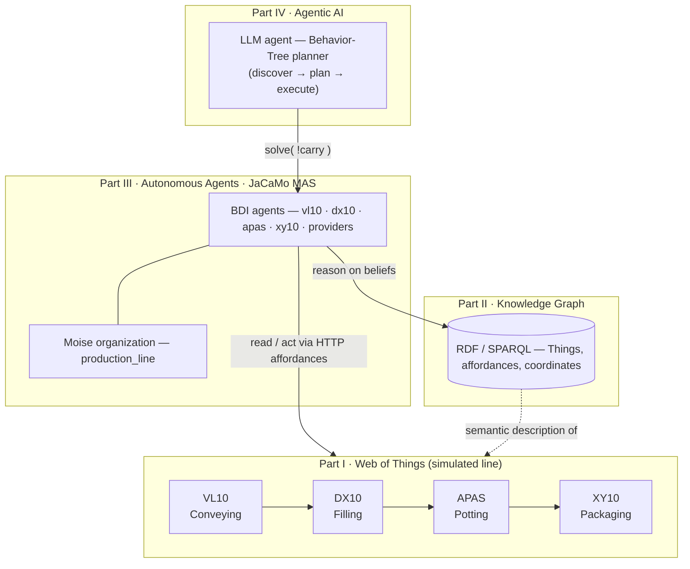

# AI4Industry Hackathon — IT'm Factory Control (My Implementation)


This repository is my work for the **AI for Industry 4.0 Summer School Hackathon** at
[École des Mines de Saint-Étienne (IMT)](https://gitlab.emse.fr/ai4industry/hackathon).
The hackathon builds a **decentralized control system for a simulated yogurt factory** — a
production line of four workshops (Conveying `VL10`, Filling `DX10`, Potting/robot-arm
`Bosch-APAS`, Packaging `XY10`) plus two external material providers. Every machine is a live
[Web of Things](https://www.w3.org/WoT/) *Thing* exposing HTTP affordances, and everything runs
against a shared online simulation (my group number is **9**, credentials `simu9`).

The system is built up in **four technology layers**, each adding one capability on top of the
previous: **(I) Web of Things** for REST/Thing-Description interoperability, **(II) Knowledge
Graph** for RDF/SPARQL semantic discovery and reasoning, **(III) Autonomous Agents** — a
JaCaMo BDI multi-agent system (Jason + CArtAgO + Moise) that controls and coordinates the
workshops, and **(IV) Agentic AI** — an LLM-based agent that plans and executes a workshop task
as a Behavior Tree. The organizers provide the framework, scaffolding and simulation; **this
README summarizes the parts I actually implemented** on top of it.

---

## Architecture

The four parts form a vertical control stack over the physical (simulated) production line: the
Web-of-Things layer exposes each machine as an HTTP *Thing*; the Knowledge Graph describes those
Things semantically; the multi-agent system reasons on that graph and drives the Things; and the
LLM agent can take over a task by planning and executing a Behavior Tree.



---

## What I implemented

### Part I — Web of Things (`wot/`)
- Completed the WoT consumer agent [`wot/src/agt/alice.asl`](wot/src/agt/alice.asl): fetch a
  workshop's Thing Description, list its property affordances, then **control** it — set the
  `VL10` conveyor speed to `0.5 m/s` and invoke `pickItem [0,0]` — driving the machine purely
  through its REST/TD interface.
- Set up **Node-RED** ([`node-red/`](node-red/)) with the Web-of-Things and FlowFuse dashboard
  libraries to consume the Things and monitor their live properties (Part I, Step 2).

### Part II — Knowledge Graph (`kg/`)
- Completed the linked-data crawler agent [`kg/src/agt/bob.asl`](kg/src/agt/bob.asl) (with its
  `beliefs.asl` / `goals.asl` rules): crawl the factory KG from its entry point and reproduce
  Alice's behavior **using ontology classes instead of hard-coded machine/affordance names**
  (e.g. find the storage rack as an `Automated_storage_and_retrieval_system`, its speed as a
  `ConveyorSpeed`), so the code keeps working if machines are swapped.
- Part II Step 4 **generic, future-proof queries**: read the filling machine's tank level by the
  *class* of any level sensor, and locate a robot arm's target relative to the filling machine's
  output area — no reliance on specific identifiers.

### Part III — Autonomous Agents / JaCaMo MAS (`mas/`) — main body of work
- **Design analysis (Step 1)** — [`mas/design-analysis.md`](mas/design-analysis.md): identifies
  the agents, artifacts/environment and organization, argues *one agent per Thing* vs. a single
  controller, and discusses the WoT Thing→Agent/Artifact mapping.
- **Robot-arm agent (Step 2)** — [`apas_agent.asl`](mas/src/agt/apas_agent.asl): a real
  pick-and-place `carry` built from the KG-reasoned affordances (`moveTo → grasp → moveTo →
  release`).
- **Workshop control & monitoring (Step 3)** — real BDI control loops replacing the stubs:
  - [`vl10_agent`](mas/src/agt/vl10_agent.asl) walks the `5×5` storage grid and feeds the line
    (`pickItem [X,Z]`), reordering cups when empty;
  - [`dx10_agent`](mas/src/agt/dx10_agent.asl) monitors `tankLevel` and reorders dairy product;
  - [`xy10_agent`](mas/src/agt/xy10_agent.asl) monitors `packageBuffer` and reorders packages;
  - each reads property affordances with test-goals and handles the stack light (emergency-stop
    on red, resume on green).
- **Coordination (Step 4)** — two mechanisms:
  - *Direct interaction*: `order` / `orderPackages` request messages and `done(...)`
    acknowledgments between workshop agents and the provider agents (added an `orderPackages`
    handler to [`cup_provider.asl`](mas/src/agt/cup_provider.asl)).
  - *Organization*: rewrote [`mas/src/org/org.xml`](mas/src/org/org.xml) as a real **Moise**
    specification (a `production_line` group with `supplier / conveyor / filler / potter /
    packager` roles, a sequential `produce_batch` scheme and obligation norms) and wired it into
    [`mas.jcm`](mas/mas.jcm) so the organization is instantiated at runtime.
- Verified live: all six agents reason out their Thing from the KG, the organization boards form,
  and the agents actuate the real simulation (robot arm moves, storage rack picks, tanks drain).

### Part IV — Agentic AI / LLM Behavior-Tree planner (`ai4industry-llm-main/`)
Goal: make the APAS robot transfer pots using an **LLM-based agent instead of the Jason agent**.
- **Discovery prompt** [`src/discovery/prompts.py`](ai4industry-llm-main/src/discovery/prompts.py):
  wrote the *Discovery Process* so the LLM systematically uses the tools
  (`fetch_artifact_graph → inspect_thing_description → list_actions → list_properties →
  get_location`) to extract the affordances it needs.
- **Planning prompt** [`src/planning/prompts.py`](ai4industry-llm-main/src/planning/prompts.py):
  wrote the *Planning Guidance* so the LLM builds a valid Behavior Tree — mapping sub-tasks to
  affordances, **guarding every action with precondition checks** (`grasp` needs an item present
  and an open gripper; `moveTo` needs valid coords and the arm idle; `release` needs the gripper
  holding), using sequences/selectors, and taking all URLs/coordinates from the discovered model.
- **Delegation** [`mas/src/agt/apas_agent.asl`](mas/src/agt/apas_agent.asl): edited `+!run` to
  delegate the goal to the LLM via the `LlmBridge` artifact's `solve(Goal)` operation, passing
  `!carry("APAS", "DX10_output", "XY10_input")` as a single string and reacting to the returned
  plan on the `llmResult` observable property.
- **Configuration** [`.env`](ai4industry-llm-main/.env): provider/model + `SIMULATOR_GROUP=9`.
- **Bug fix** (beyond the assigned edits, needed for a successful run):
  [`src/discovery/td_tools.py`](ai4industry-llm-main/src/discovery/td_tools.py) `fetch_graph`
  could not resolve any artifact on this KG — it built `itmfactory/{name}#this` without following
  redirects, so `apas` 404'd (the robot's KG slug is `bosch-apas`) and `dx10`/`xy10` 301'd. Added
  a name alias (`apas → bosch-apas`) and `follow_redirects=True`.
- **Result**: end-to-end **SUCCESS** — the LLM discovers the real affordances, plans a correct
  guarded Behavior Tree using the `/simu/robotArm/...` endpoints and KG coordinates, and executes
  the full carry on the live simulation.

---

## Running

Prerequisites: JDK 21 (JaCaMo runs via the bundled Gradle wrapper), and Python 3 for Part IV.
Replace the group number / credentials with your own where relevant.

```bash
./gradlew wot     # Part I  — WoT consumer agent (alice)
./gradlew kg      # Part II — KG crawler agent (bob)
./gradlew mas     # Part III — multi-agent factory control
```

Part IV (two terminals — the LLM bridge needs an API key set in `ai4industry-llm-main/.env`):

```bash
cd ai4industry-llm-main && ./venv/bin/python llmbridge.py   # terminal A: LLM agent + bridge
mas/reset-simu 9 && ./gradlew mas                            # terminal B: MAS delegates carry to the LLM
```

---

## Attribution

Base project, framework and simulation by the **AI4Industry Summer School** team at École des
Mines de Saint-Étienne / IMT — <https://gitlab.emse.fr/ai4industry/hackathon> (LLM component:
<https://gitlab.emse.fr/ai4industry/ai4industry-llm>). Data and slides from earlier editions are
available via that repository's Git tags (e.g. `ai4industry2020`). This repository contains my
implementation of the hackathon tasks on top of that framework.
