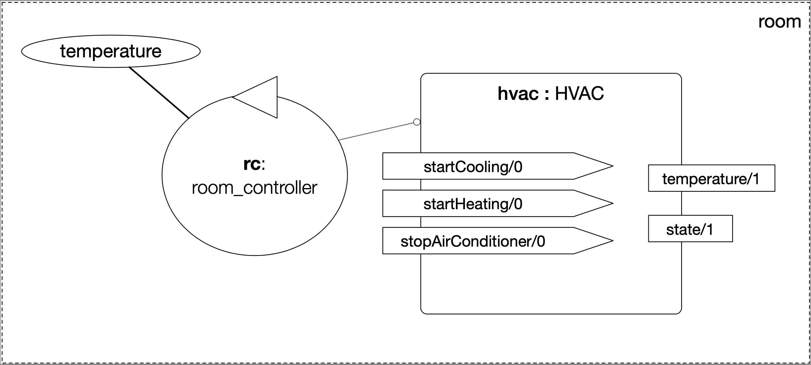

= Multi-Agent Systems Exercises
:toc: left
:author: 2026 AI4Industry Summer School
:date: July 2026
:source-highlighter: coderay
:coderay-linenums-mode: inline
:icons: font
:prewrap!:

This guide contains practical material for the lecture on _Multi-Agent Systems_ at the link:https://ci.mines-stetienne.fr/ai4industry/2026/[2026 AI4Industry Summer School].

*NOTE:* Material based on the tutorial on _Multi-Agent Oriented Programming_ presented at link:https://easss23.fit.cvut.cz[23rd European Agent Systems Summer School], 2023, Prague.

== Smart Room Scenario

The objective is to develop a Multiagent System (MAS) to control the temperature of a room so that it reaches some desired temperature.

* The room is equipped with a "Heating, Ventilating and Air Conditioning" (HVAC), that provides
** the current room temperature
** operations to start cooling, start heating, and stop the machine
* In the baseline scenario, we have one agent that has the goal of maintaining a certain temperature

== Installation

=== Requirements

* https://git-scm.com[Git]
* https://adoptium.net[Java JDK 21]
* https://curl.se[`curl`]
* Text editor of your choice (e.g. https://code.visualstudio.com[Visual Studio Code (VSCode)], https://www.gnu.org/software/emacs/[emacs], https://notepad-plus-plus.org/[Notepad++])

=== Install

Open a terminal and execute the following commands:
----
git clone https://gitlab.emse.fr/ai4industry/mas.git
cd mas
----

== Agent Dimension (Lab 1)

=== Task 1: Run the initial project for the smart room scenario

To run the initial project, type the commands below in the terminal:
----
cd lab1/smart-room-sa
./gradlew
----

You can see how the system reacts to changes in the room temperature by opening another terminal and executing the command:

----
curl -X POST  http://localhost:8080/workspaces/room/artifacts/hvac/properties/temperature -H 'Content-Type: application/json' -d '[ 10 ]'
----

Replace the number 10 in between brackets by the current temperature of the room.

=== Task 2: Reading and understanding agent programs

* Exercise 1: open the code of the room controller agent (file `src/agt/room_controller.asl`), read the code and identify the beliefs, goals, and plans. Try to map the program to the observed behavior.

* Exercise 2: open the _mind inspector_ (http://localhost:3272) for the agent `rc` and compare the beliefs there with those identified in the program. Are they the same? Are they represented the same way? 

* Exercise 3: change the program so that the target temperature is 15.

=== Task 3: Improve the implementation

* Exercise 1: add a new plan to print the current state of the HVAC.

* Exercise 2: change the plans of the previous exercise so that when the HVAC state is `"cooling"` it is printed "so cool" and, when the state is `"heating"` it is printed "so hot".

== Agent Communication (Lab 2)

=== Task 1: Experiment different performatives

* Exercise 1: open the project `lab2/e1`, read the `.jcm` file and the program of the two agents, and execute the application. Now change the plan of Bob to:
+
----
+!start 
   <- .send(alice, tell, hello);
      .send(alice, tell, hello);
   .
----
+
run the project again and notice the difference. Now change the plan again to
+
----
+!start 
   <- .send(alice, signal, hello);
      .send(alice, signal, hello);
   .
----
+
run the project again and notice the difference. 

* Exercise 2: open the project `lab2/e2`, read the `.jcm` file and the program of the three agents, and execute the application. Use the mind inspector to see the beliefs of the agents (specially Alice). Now change the plan of Alice to:
+
----
+!start
   <- .wait(500);
      .send(karlos, askOne, vl(_), vl(X));
      .println(X).
----
+
run the project again and notice the difference. 

=== Task 2: Improve the project for the voting protocol

In this scenario, there are several agents that have a preferred temperature. Each vote for the closest temperature in a list of options and the temperature with the majority of votes is set in the HVAC.

You can run the project with the following commands:
----
cd lab2/smart-room-ma
./gradlew
----

* Exercise 1: change the list of options offered to the personal assistants. 

== Environment Dimension (Lab 3)

We will now implement the voting mechanism as an artifact: agents will use a _voting machine_ artifact to select the target temperature for the shared room based on their individual preferences.

Most of the code required for this practical session is already provided in the link:lab3/smart-room-vm[lab3/smart-room-vm] project. The following tasks will guide you through adding the last lines of code that will bring everything together.

=== Task 1: Implement the usage interface for the voting machine

The artifact template for our voting machine is defined in the link:lab3/smart-room-vm/src/env/voting/VotingMachine.java[VotingMachine.java] class, but the usage interface is not yet fully implemented. Your first task is to complete this implementation. The following sub-tasks will guide you through it, note also the `TODO` items marked in comments in the Java class.

- Exercise 1: your very first task is to complete the artifact's `init` method by defining an observable property `status` and setting its value to `open`.
- Exercise 2: your second task is to complete the implementation of the `open`, `vote`, and `close` operations.

To solve these tasks, you will have to define and work with observable properties. Tips for a quick start:

- you can have a look at the implementation of the link:lab3/smart-room-vm/src/env/devices/HVAC.java[HVAC artifact]
- you can check out the _Example 01 — Artifact definition, creation, and use_ in the https://github.com/CArtAgO-lang/cartago/blob/master/docs/cartago_by_examples/cartago_by_examples.pdf[CArtAgO by Examples]

*Note:* The personal assistant agents are not yet expressing any votes. If you run the project at this point, the voting machine will always return the first option as the winning option (default behavior).

=== Task 2: Instantiate and use the voting machine

Your voting machine is now ready — and the room controller agent is, in fact, already using it (see link:lab3/smart-room-vm/src/agt/room_controller.asl[room_controller.asl]). Still, a few bits are missing:

- Exercise 1: your first task is to complete the `TODOs` defined in link:lab3/smart-room-vm/src/agt/personal_assistant.asl[personal_assistant.asl] so that agents can focus on the voting machine and vote for their preferences.

- Exercise 2: the personal assistant agents are now expressing their votes, but still nothing is happening. That is because the voting is never closed. See the `TODO` on `line 33` of link:lab3/smart-room-vm/src/agt/room_controller.asl[room_controller.asl].

To solve these tasks, you will need to use the `focus` operation and to invoke artifact operations defined by the voting machine. Tips for a quick start:

* see Lines 19 in link:lab3/smart-room-vm/src/agt/room_controller.asl[room_controller.asl] for an example of using the `focus` operation

* see Line 24 in link:lab3/smart-room-vm/src/agt/room_controller.asl[room_controller.asl] for an example of invoking the `open` operation of the voting machine

* note: the voting machine is defined within the `vm::` namespace (see Lines 19 and 24 above for usage examples)

Our agents are now using the voting machine to set the temperature in the shared room. At the moment, however, the room controller agent needs to invoke the `close` operation on the voting machine to close the voting, even though the voting machine is already configured with a timeout.

== Organisation Dimension (Lab 4)

=== Task 1: Changing the organization

* Exercise 1: open the project `lab4/smart-room-org`, execute the application and analyze the results of the group and scheme in the _organization inspector_ (http://localhost:3171).

* Exercise 2: change the maximum number of `assistant` to 2. Execute the application. What is the outcome? Change the organization to solve the problem and keeping the maximum number of `assistant` to 2?

* Exercise 3: change the order of `announce_options` and `open_voting` in the scheme `decide_temp`. What changes do you observe in the outcome?

=== Task 2: Handling the state of the organization

* Exercise 1: implement a plan in the `room_controller` agent that displays all fulfilled obligations. Hint: consider the organizational event `oblFulfilled/1`.
+
----
oblFulfilled(O) : Obligation O was fulfilled
----
